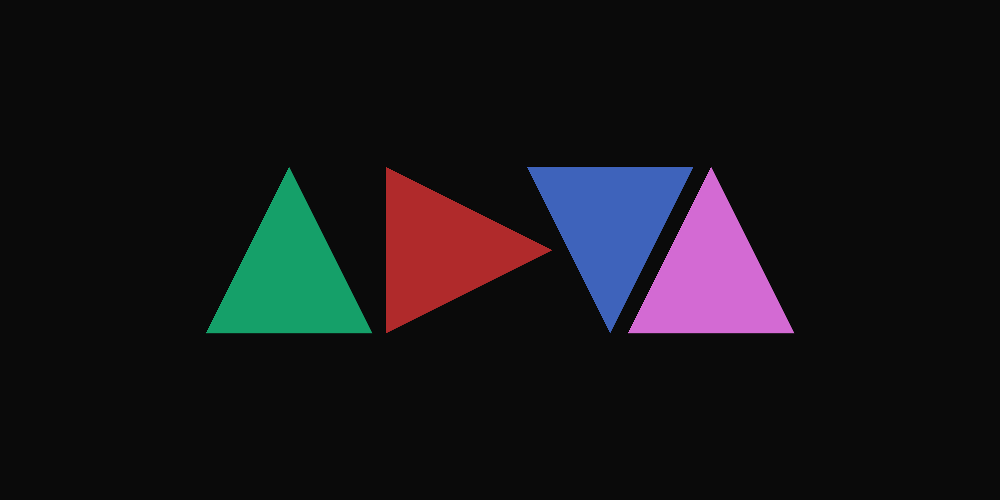

<h1 align="center">annyeong 👋</h1>
 

<h2 align="center">a self-proclaim frontend developer who currently being an IT student at UGM since 2020</h2>

<h3 align="center">hit me up on:</h3>

&nbsp;
&nbsp;

<h3 align="center">language and tools:</h3>

&nbsp;
&nbsp;
&nbsp;
&nbsp;
&nbsp;
&nbsp;
&nbsp;

 
&nbsp;
&nbsp;
&nbsp;

 
&nbsp;

